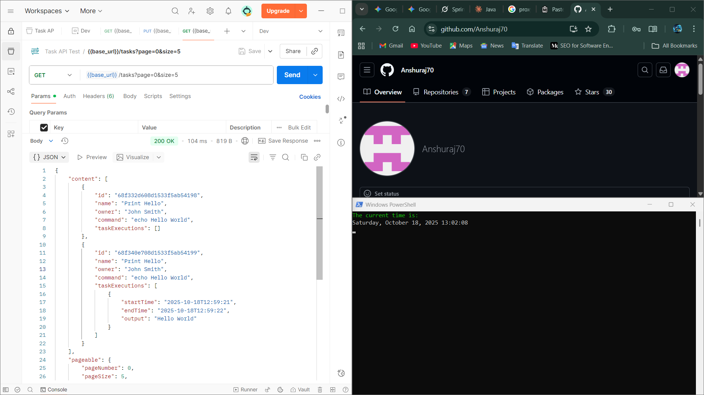
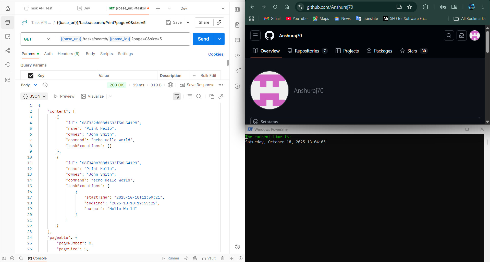
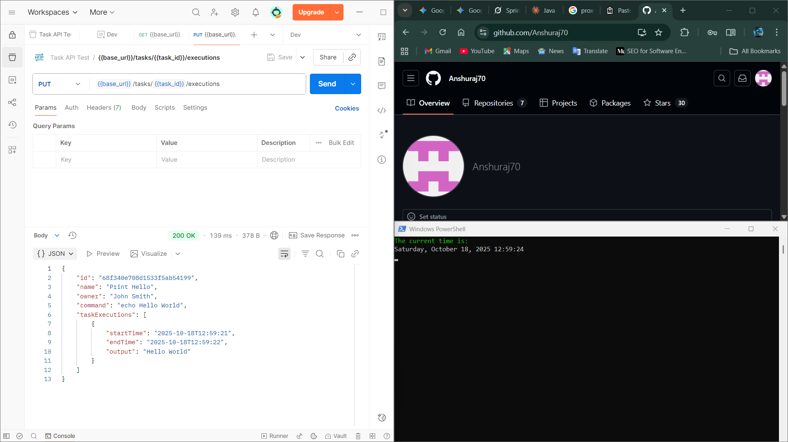
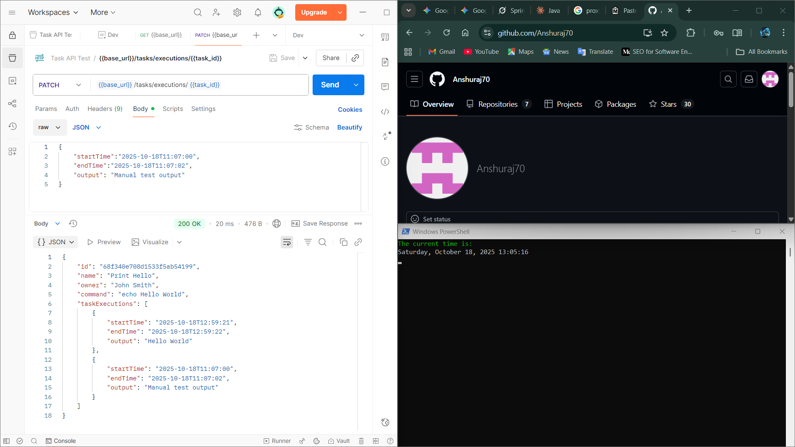
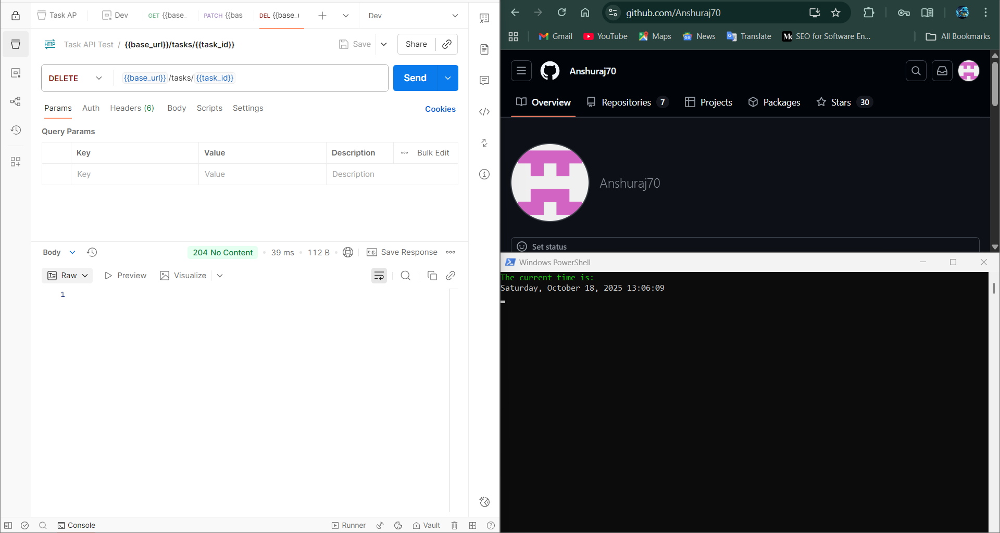
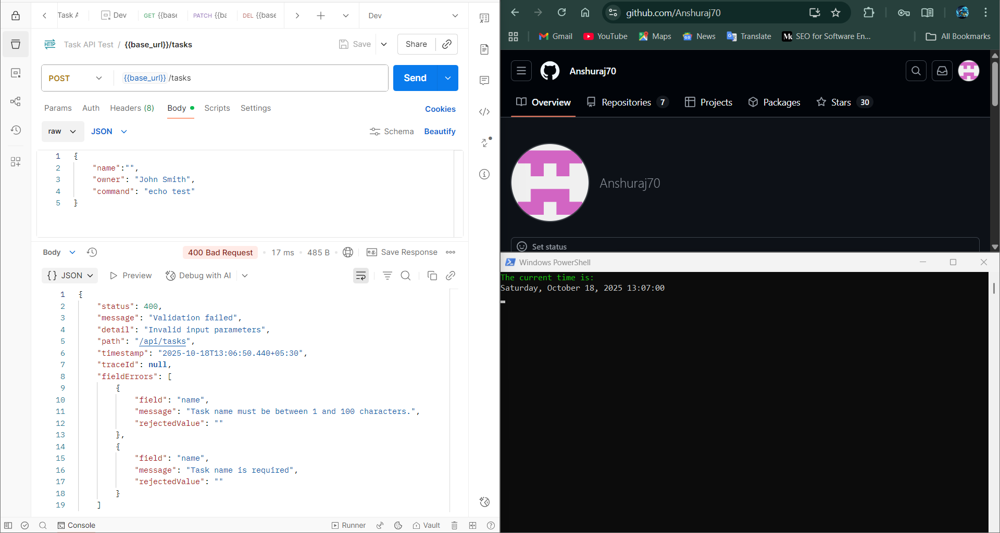
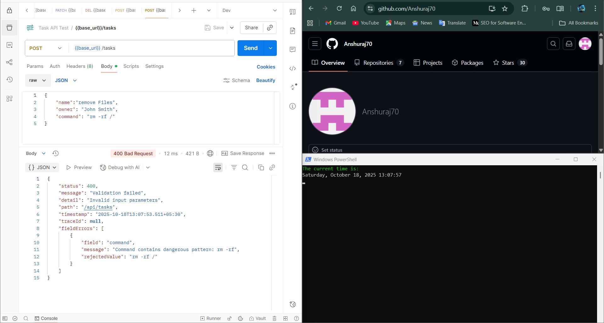
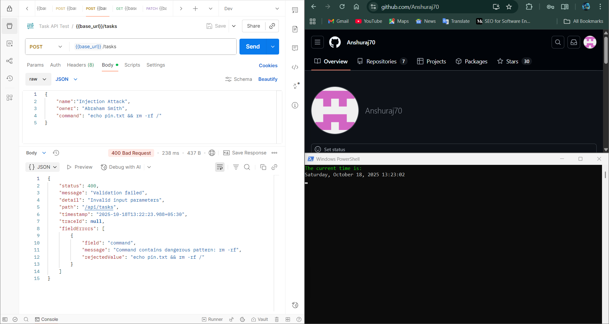
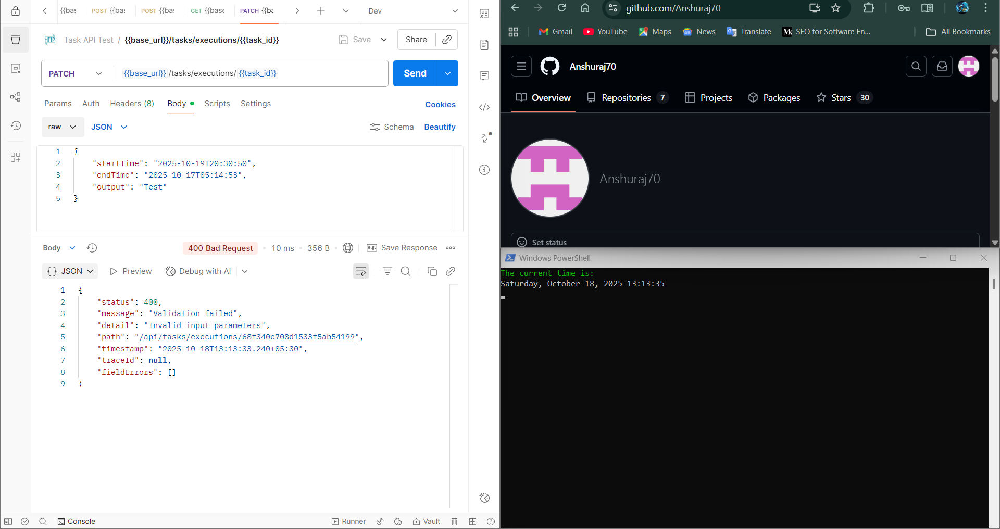
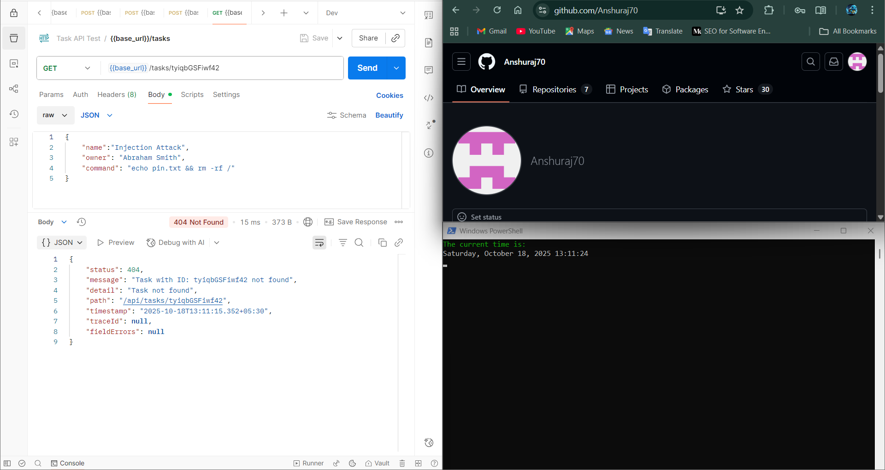

# Task Execution REST API

A Spring Boot REST API for creating, managing, and executing shell commands as tasks with execution history tracking in MongoDB.

## Table of Contents
- [Overview](#overview)
- [Features](#features)
- [Technology Stack](#technology-stack)
- [Prerequisites](#prerequisites)
- [Installation](#installation)
- [Configuration](#configuration)
- [Running the Application](#running-the-application)
- [API Endpoints](#api-endpoints)
- [Request Examples](#request-examples)
- [Response Examples](#response-examples)
- [Validation](#validation)
- [Error Handling](#error-handling)
- [Testing](#testing)
- [Project Structure](#project-structure)
- [Author](#author)

---

## Overview

This REST API provides a complete task management system that allows users to:
- Create and store task definitions (shell commands)
- Execute tasks and capture output
- Track execution history with timestamps
- Search and filter tasks
- Validate commands for security

Each task can have multiple executions, with each execution recording:
- Start time
- End time
- Command output

---

## Features

-- **RESTful API** - Full CRUD operations for task management  
-- **Command Execution** - Execute shell commands safely with timeout protection  
-- **Execution History** - Track all task executions with timestamps and output  
-- **Input Validation** - Prevent invalid command injection  
-- **Error Handling** - Comprehensive exception handling with meaningful error messages  
-- **Pagination** - Paginated results for listing tasks  
-- **Search Functionality** - Search tasks by name  and id
-- **Cross-platform** - Works on Windows, Linux, and macOS  
-- **Logging** - Detailed logging for debugging and monitoring  

---

## Technology Stack

- **Framework:** Spring Boot 3.5.6
- **Language:** Java 17
- **Database:** MongoDB 8.0.5
- **Build Tool:** Maven 3.x
- **Validation:** Jakarta Validation API + Hibernate Validator
- **Logging:** SLF4J + Logback

### Dependencies
- Spring Boot Starter Web
- Spring Boot Starter Data MongoDB
- Spring Boot Starter Validation
- Jackson (JSON processing)
- Hibernate Validator

---

## Prerequisites

Before you begin, ensure you have the following installed:

1. **Java 17+**
   ```bash
   java -version
   ```

2. **Maven 3.x+**
   ```bash
   mvn -version
   ```

3. **MongoDB 8.0+**
   - Download from: https://www.mongodb.com/try/download/community
   - Or use MongoDB Atlas (cloud): https://www.mongodb.com/cloud/atlas

4. **Git**
   ```bash
   git --version
   ```

---

## Installation

### Step 1: Clone the Repository

```bash
git clone <your-repository-url>
cd javabackend
```

### Step 2: Create MongoDB Data Directory (Windows)

```bash
mkdir C:\data\db
```

### Step 3: Install Dependencies

```bash
mvn clean install
```

---

## Configuration

### MongoDB Setup

#### Option 1: Local MongoDB (Windows)

1. Create data directory:
```bash
mkdir C:\data\db
```

2. Start MongoDB:
```bash
mongod
```


### Application Configuration

Edit `src/main/resources/application.properties`:

```properties
# Application
spring.application.name=javabackend
server.port=8080

# MongoDB
spring.data.mongodb.uri=mongodb://localhost:27017/TasksDB
spring.data.mongodb.host=localhost
spring.data.mongodb.port=27017
spring.data.mongodb.database=myappdb

# Logging
logging.level.root=INFO
logging.level.com.javabackend=DEBUG
logging.level.org.springframework.web=DEBUG

# Error Handling
server.error.include-message=always
server.error.include-binding-errors=always
server.error.include-stacktrace=on_param
server.error.include-exception=false

# Validation
spring.web.resources.add-mappings=false
```

---

## Running the Application

### Method 1: Using Maven

```bash
mvn spring-boot:run
```

### Method 2: Using IDE

1. Open project in IntelliJ IDEA or Eclipse
2. Right-click `JavabackendApplication.java`
3. Click "Run" or "Run As" → "Java Application"

### Verify Application is Running

- Open browser: `http://localhost:8080`
- Should return 404 (expected - no root endpoint)
- Check console for: `Started JavabackendApplication in X.XXX seconds`

---

## API Endpoints

### 1. Create Task
**POST** `/api/tasks`

Creates a new task with command validation.

**Request:**
```json
{
    "name": "Print Hello",
    "owner": "John Smith",
    "command": "echo Hello World"
}
```

**Response (201 Created):**
```json
{
    "id": "6534a1b2c3d4e5f6g7h8i9j0",
    "name": "Print Hello",
    "owner": "John Smith",
    "command": "echo Hello World",
    "taskExecutions": []
}
```

---

### 2. Get All Tasks
**GET** `/api/tasks?page=0&size=5`

Returns paginated list of all tasks.

**Query Parameters:**
- `page` (default: 0) - Page number
- `size` (default: 5) - Items per page (max: 100)

**Response (200 OK):**
```json
{
    "content": [
        {
            "id": "6534a1b2c3d4e5f6g7h8i9j0",
            "name": "Print Hello",
            "owner": "John Smith",
            "command": "echo Hello World",
            "taskExecutions": []
        }
    ],
    "totalElements": 1,
    "totalPages": 1
}
```

---

### 3. Get Task by ID
**GET** `/api/tasks/{id}`

Returns a specific task by ID.

**Path Parameters:**
- `id` (required) - Task ID

**Response (200 OK):**
```json
{
    "id": "6534a1b2c3d4e5f6g7h8i9j0",
    "name": "Print Hello",
    "owner": "John Smith",
    "command": "echo Hello World",
    "taskExecutions": []
}
```

**Error (404 Not Found):**
```json
{
    "status": 404,
    "message": "Task with ID: invalid-id not found",
    "detail": "Task not found"
}
```

---

### 4. Search Tasks by Name
**GET** `/api/tasks/search/{name}?page=0&size=5`

Search for tasks containing the specified name.

**Path Parameters:**
- `name` (required) - Search term

**Query Parameters:**
- `page` (default: 0)
- `size` (default: 5)

**Response (200 OK):**
```json
{
    "content": [
        {
            "id": "6534a1b2c3d4e5f6g7h8i9j0",
            "name": "Print Hello",
            "owner": "John Smith",
            "command": "echo Hello World",
            "taskExecutions": []
        }
    ],
    "totalElements": 1,
    "totalPages": 1
}
```

---

### 5. Execute Task Command (MAIN ENDPOINT)
**PUT** `/api/tasks/{id}/executions`

Executes the task command and records execution details.

**Path Parameters:**
- `id` (required) - Task ID

**Request Body:** (Empty)

**Response (200 OK):**
```json
{
    "id": "6534a1b2c3d4e5f6g7h8i9j0",
    "name": "Print Hello",
    "owner": "John Smith",
    "command": "echo Hello World",
    "taskExecutions": [
        {
            "startTime": "2025-10-17T23:10:45.123",
            "endTime": "2025-10-17T23:10:45.234",
            "output": "Hello World"
        }
    ]
}
```

---

### 6. Add Manual Execution (Testing)
**PATCH** `/api/tasks/executions/{id}`

Manually add an execution record (for testing purposes).

**Path Parameters:**
- `id` (required) - Task ID

**Request:**
```json
{
    "startTime": "2025-10-17T20:30:45",
    "endTime": "2025-10-17T20:30:50",
    "output": "Manual test output"
}
```

**Response (200 OK):**
```json
{
    "id": "6534a1b2c3d4e5f6g7h8i9j0",
    "name": "Print Hello",
    "owner": "John Smith",
    "command": "echo Hello World",
    "taskExecutions": [
        {
            "startTime": "2025-10-17T23:10:45.123",
            "endTime": "2025-10-17T23:10:45.234",
            "output": "Hello World"
        },
        {
            "startTime": "2025-10-17T20:30:45",
            "endTime": "2025-10-17T20:30:50",
            "output": "Manual test output"
        }
    ]
}
```

---

### 7. Delete Task
**DELETE** `/api/tasks/{id}`

Deletes a task and all its execution history.

**Path Parameters:**
- `id` (required) - Task ID

**Response (204 No Content)**
- No response body
- HTTP Status: 204

---

## Request Examples

### Using cURL

**Create Task:**
```bash
curl -X POST http://localhost:8080/api/tasks \
  -H "Content-Type: application/json" \
  -d '{
    "name": "List Files",
    "owner": "admin",
    "command": "ls -la"
  }'
```

**Get All Tasks:**
```bash
curl -X GET "http://localhost:8080/api/tasks?page=0&size=5"
```

**Execute Task:**
```bash
curl -X PUT http://localhost:8080/api/tasks/{taskId}/executions
```

**Search Tasks:**
```bash
curl -X GET "http://localhost:8080/api/tasks/search/List?page=0&size=5"
```

**Delete Task:**
```bash
curl -X DELETE http://localhost:8080/api/tasks/{taskId}
```

---

## Validation

The API includes comprehensive input validation:

### Command Validation
Commands are validated to prevent dangerous operations:

**Forbidden Patterns:**
- `rm -rf` - Recursive file deletion
- `dd if=/dev/zero` - Disk wiping
- `sudo` - Privilege escalation
- `chmod 777` - Permission changes
- `kill -9` - Process termination
- `:() { :|:&` - Fork bomb

**Forbidden Symbols:**
- `&&` - Command chaining
- `||` - Or operator
- `;` - Command separator
- `&` - Background execution
- `|` - Pipe operator
- `` ` `` - Command substitution
- `$(` - Command substitution

**Command Constraints:**
- Maximum 1000 characters
- Cannot be empty
- Cannot be null

### Field Validation
- **Name:** 1-100 characters, required
- **Owner:** 1-100 characters, required
- **Command:** 1-1000 characters, required, must be safe
- **StartTime:** Required, must be before endTime
- **EndTime:** Required, must be after startTime
- **Output:** Required, cannot be empty

### Example: Validation Error

**Request with dangerous command:**
```json
{
    "name": "Dangerous",
    "owner": "admin",
    "command": "rm -rf /"
}
```

**Response (400 Bad Request):**
```json
{
    "status": 400,
    "message": "Validation failed",
    "detail": "Invalid input parameters",
    "fieldErrors": [
        {
            "field": "command",
            "message": "Invalid command: contains unsafe operations",
            "rejectedValue": "rm -rf /"
        }
    ]
}
```

---

## Error Handling

All errors return consistent JSON responses:

### Error Response Format
```json
{
    "status": 400,
    "message": "Error description",
    "detail": "Error detail/type",
    "path": "/api/endpoint",
    "timestamp": "2025-10-17T23:10:45"
}
```

### HTTP Status Codes

| Status | Meaning | Example |
|--------|---------|---------|
| 200 | OK | Successfully retrieved or updated |
| 201 | Created | Task created successfully |
| 204 | No Content | Task deleted successfully |
| 400 | Bad Request | Validation error, invalid input |
| 404 | Not Found | Task not found |
| 500 | Server Error | Unexpected error |

### Common Error Messages

**Task Not Found:**
```json
{
    "status": 404,
    "message": "Task with ID: xyz not found",
    "detail": "Task not found"
}
```

**Invalid Pagination:**
```json
{
    "status": 400,
    "message": "Page and size must be non-negative",
    "detail": "Invalid argument provided"
}
```

**Command Execution Timeout:**
```json
{
    "status": 400,
    "message": "Command execution timeout after 30 seconds",
    "detail": "Invalid or unsafe command"
}
```

---

## Testing

### Prerequisites for Testing
1. MongoDB running: `mongod`
2. Application running: `mvn spring-boot:run`
3. Postman installed

### Test Cases Covered

✅ **Functional Tests:**
- Create task (POST)

- Get all tasks (GET)

- Get task by ID (GET)

- Search tasks by name (GET)

- Execute task command (PUT)

- Add manual execution (PATCH)

- Delete task (DELETE)


✅ **Validation Tests:**
- Empty task name (400)

- Dangerous commands (400)

- Command injection attempts (400)

- Invalid date range (400)


✅ **Error Handling Tests:**
- Non-existent task (404)


### Testing with Postman

1. Import collection or create manually
2. Set environment variable: `base_url=http://localhost:8080/api`

Environment variable task_id value was pasted after creating the task using POST request.
3. Execute tests in order
4. Verify responses match expected results

---

## Project Structure

```
javabackend/
├── src/main/java/com/javabackend/
│   ├── javabackend/
│   │   └── JavabackendApplication.java      # Main entry point
│   ├── config/
│   │   └── MongoConfig.java                 # MongoDB configuration
│   ├── controllers/
│   │   └── DemoController.java              # REST endpoints
│   ├── service/
│   │   ├── TaskService.java                 # Business logic
│   │   └── CommandExecutorService.java      # Command execution
│   ├── repository/
│   │   └── TaskRepository.java              # Database queries
│   ├── model/
│   │   ├── Task.java                        # Task entity
│   │   └── TaskExecution.java               # Execution entity
│   ├── exception/
│   │   ├── GlobalExceptionHandler.java      # Exception handling
│   │   ├── ErrorResponse.java               # Error model
│   │   ├── TaskNotFoundException.java        # Custom exception
│   │   └── InvalidCommandException.java     # Custom exception
│   └── validation/
│       ├── ValidCommand.java                # Command validator annotation
│       ├── CommandValidator.java            # Command validation logic
│       ├── ValidDateRange.java              # Date range annotation
│       └── DateRangeValidator.java          # Date range validation
├── src/main/resources/
│   └── application.properties               # Application configuration
├── pom.xml                                   # Maven dependencies
└── README.md                                 # This file
```

---

## Troubleshooting

### MongoDB Connection Error
**Problem:** `Connection refused to 127.0.0.1:27017`

**Solution:**
```bash
# Ensure MongoDB is running
mongod

# Verify connection
mongosh
```

### Port Already in Use
**Problem:** `Address already in use: 8080`

**Solution:**
```bash
# Change port in application.properties
server.port=8081

# Or kill process using port 8080
lsof -ti:8080 | xargs kill -9  # Linux/Mac
```

### Command Execution Timeout
**Problem:** Command takes longer than 30 seconds

**Solution:**
- Commands are limited to 30 seconds for safety
- Increase timeout in `CommandExecutorService.java` if needed:
```java
private static final long COMMAND_TIMEOUT_SECONDS = 60;  // Change to desired value
```

---

## Performance Notes

- **Command Timeout:** 30 seconds maximum
- **Output Limit:** 10KB per execution
- **Command Length:** 1000 characters maximum
- **Pagination:** Maximum 100 items per page

---

## Security Considerations

1. **Command Validation:** All commands are validated for dangerous patterns
2. **Input Sanitization:** All inputs are trimmed and validated
3. **Timeout Protection:** Commands timeout after 30 seconds
4. **Output Truncation:** Output is limited to 10KB to prevent memory issues
5. **Error Messages:** Sensitive details are hidden from clients

---

## Future Enhancements

- [ ] User authentication and authorization
- [ ] Task scheduling (cron-like functionality)
- [ ] Task dependencies
- [ ] Execution notifications (email, webhook)
- [ ] Task versioning
- [ ] Execution logs storage and search
- [ ] API rate limiting
- [ ] GraphQL support

---

## Author

Anshu Abhishek Raj

GitHub: https://github.com/Anshuraj70

---

## Support

For issues, questions, or suggestions, please:
1. Check existing issues on GitHub
2. Create a new issue with detailed description
3. Contact the author

---

## Acknowledgments

- Spring Boot Documentation
- MongoDB Documentation
- Jakarta Validation API
- Hibernate Validator

